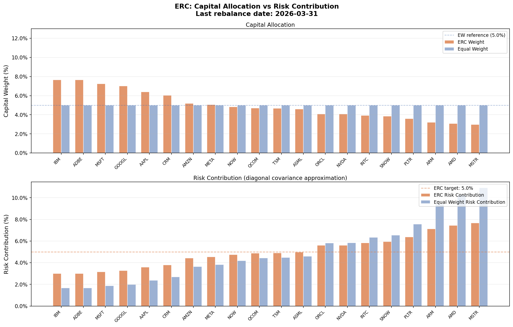

# LSEG Thematic Portfolio Optimization

[](https://www.python.org/)
[](https://github.com/Morwane/lseg-thematic-portfolio-optimization/actions/workflows/ci.yml)
[](https://developers.refinitiv.com/)
[](https://opensource.org/licenses/MIT)

A research-grade portfolio optimization study on a concentrated 20-stock AI/Tech universe, built with daily price data from the LSEG Data API. The project compares five allocation strategies over a monthly walk-forward backtest (2021–2026), with stress testing, factor exposure analysis, and a Black-Litterman extension.

**Main finding:** Equal Risk Contribution (ERC) is the most balanced and defensible allocation in this universe. It delivers a better return-to-drawdown profile than both pure growth strategies (Max Sharpe, Equal Weight) and purely defensive ones (Min Variance, Min CVaR), without requiring return estimates.

---

## Main insight

In a concentrated AI/Tech universe, Equal Weight spreads **capital** equally across 20 names. But high-volatility names like NVDA and MSTR dominate the risk budget — a 5% allocation to NVDA contributes far more to portfolio volatility than a 5% allocation to IBM.

ERC corrects this. It finds weights such that every asset contributes the same amount to total portfolio volatility. The result is genuine risk diversification, not just capital spreading. In practice, ERC underweights semiconductor names and overweights stable enterprise names — producing a lower drawdown and a better Calmar ratio than either Equal Weight or Max Sharpe, while avoiding the excessive defensiveness of Min Variance.

> **Equal Weight** diversifies capital. **ERC** diversifies risk. In a concentrated universe, the distinction matters.

---

## What this project does

- Builds a 20-stock AI/Tech universe using daily closing prices from the LSEG Data API
- Runs a monthly walk-forward backtest (252-day lookback) with 15 bps transaction costs and a 20% weight cap
- Compares five allocation strategies: Equal Weight, Min Variance, Max Sharpe, ERC, Min CVaR
- Produces ERC-specific outputs: capital vs risk decomposition, weight stability over time
- Stress-tests all strategies against Rate Shock 2022 and AI Correction 2025
- Computes factor exposures (beta, momentum, sector allocation) at each rebalance
- Extends with a Black-Litterman walk-forward using systematic momentum views

---

## Universe — 20 AI/Tech stocks

| Ticker | Company | History |
|--------|---------|---------|
| NVDA.O | NVIDIA | Full (2020–) |
| MSFT.O | Microsoft | Full (2020–) |
| GOOGL.O | Alphabet | Full (2020–) |
| META.O | Meta | Full (2020–) |
| AMZN.O | Amazon | Full (2020–) |
| AAPL.O | Apple | Full (2020–) |
| AMD.O | AMD | Full (2020–) |
| CRM.N | Salesforce | Full (2020–) |
| ORCL.N | Oracle | Full (2020–) |
| ADBE.O | Adobe | Full (2020–) |
| QCOM.O | Qualcomm | Full (2020–) |
| INTC.O | Intel | Full (2020–) |
| IBM.N | IBM | Full (2020–) |
| NOW.N | ServiceNow | Full (2020–) |
| MSTR.O | MicroStrategy | Full (2020–) |
| TSM.N | TSMC | Full (2020–) |
| ASML.O | ASML | Full (2020–) |
| SNOW.N | Snowflake | From Sep 2020 |
| ARM.O | ARM Holdings | From Sep 2023 |
| PLTR.N | Palantir | From Nov 2024 |

SNOW, ARM, and PLTR enter progressively as their return history reaches the 252-day lookback threshold. Each rebalance window independently excludes any ticker with insufficient data — no contamination of the covariance matrix.

---

## Methodology

### Walk-forward setup

| Parameter | Value |
|---|---|
| Rebalance frequency | Monthly |
| Lookback window | 252 trading days |
| Transaction cost | 15 bps per turnover unit |
| Max weight per stock | 20% |
| Risk-free rate | 4% annualized |
| Backtest period | Jan 2021 – Apr 2026 |

Each month, the optimizer sees only the past 252 trading days of returns. This avoids look-ahead bias and forces the strategies to adapt to evolving volatility regimes and correlations.

### Strategies compared

| Strategy | Objective | Solver |
|---|---|---|
| Equal Weight | Uniform capital allocation | — |
| Min Variance | $\min_w\ w^\top \Sigma w$ | SLSQP |
| Max Sharpe | $\max_w\ (w^\top\mu - r_f)/\sigma_p$ | SLSQP |
| **ERC** | **Equalize each asset's risk contribution** | **SLSQP** |
| Min CVaR | $\min_{w,\zeta,u}\ \zeta + \frac{1}{(1-\alpha)T}\sum_t u_t$ | HiGHS LP |

All strategies: long-only, fully invested, 20% max weight.

**Min CVaR** uses the Rockafellar-Uryasev LP reformulation (HiGHS solver), which guarantees a global optimum on the convex CVaR objective.

---

## A — Core results

### Performance summary (Jan 2021 – Apr 2026)

| Portfolio | Ann. Return | Ann. Vol | Sharpe | Max Drawdown | Calmar |
|-----------|------------:|---------:|-------:|-------------:|-------:|
| Equal Weight | 18.48% | 28.93% | 0.50 | −41.1% | 0.45 |
| Min Variance | 12.29% | 20.83% | 0.40 | −29.1% | 0.42 |
| Max Sharpe | 22.33% | 30.94% | 0.59 | −41.5% | 0.54 |
| **ERC** | **17.22%** | **25.06%** | **0.53** | **−33.9%** | **0.51** |
| Min CVaR | 15.48% | 21.89% | 0.52 | −31.2% | 0.50 |

*Source: `output/reports/portfolio_summary_v2.csv` — regenerated at each run.*

### How to read these results

**Max Sharpe** generates the highest return (22.3%) but incurs the worst drawdown (−41.5%). Equal Weight takes the same downside without the return upside — a poor trade. Both are dominated by ERC on a risk-adjusted basis once drawdown is factored in.

**ERC** delivers 17.2% annualized with only −33.9% max drawdown and the second-best Calmar ratio (0.51). It achieves this without estimating expected returns — only the covariance structure matters. This makes it more robust to estimation error than Max Sharpe.

**Min Variance and Min CVaR** are the most defensive postures: drawdowns of −29% and −31%, but lower returns (12–15%) reflecting their heavy Cloud/Enterprise concentration. Both sacrifice return for protection that ERC partially captures at lower cost.

**Sharpe ratios** are close (0.40–0.59), which means the strategies are not sharply differentiated on a daily-return basis alone. The decisive difference appears in the drawdown profile: ERC's −33.9% sits 7+ percentage points above EW and Max Sharpe, while keeping a Sharpe comparable to both.


---

## B — Why ERC is the flagship allocation

### Capital allocation vs risk contribution

The chart below is the most important figure in this project. It shows the capital weight and risk contribution for each asset under Equal Weight and ERC at the final rebalance.



Under Equal Weight, high-volatility names (NVDA, MSTR, AMD) each receive 5% of capital but contribute 8–12% of portfolio risk. Low-volatility names (IBM, ORCL) receive the same 5% capital allocation but only 2–3% of portfolio risk. The EW risk budget is dominated by a small number of high-vol names.

ERC corrects this by solving for the weights where every asset contributes approximately 1/N of total portfolio variance. The result: NVDA and MSTR receive 2–3% capital weight; IBM and ORCL receive 7–8%. Capital allocation becomes unequal so that risk is shared equally.

### ERC weight stability

ERC weights evolve smoothly over the 63-month backtest. The optimizer does not chase short-term volatility spikes, and the 15 bps transaction cost has a modest impact. This confirms that ERC is not just theoretically attractive — it is reasonably stable and practical to implement.

### Factor exposure

| Strategy | Beta | Momentum | Semiconductors | Cloud/Enterprise | Software | Consumer |
|---|---:|---:|---:|---:|---:|---:|
| Equal Weight | 1.00 | 0.30 | 35.0% | 35.0% | 20.0% | 5.0% |
| Min Variance | 0.59 | 0.19 | 5.7% | 81.4% | 0.0% | 12.9% |
| Max Sharpe | 0.98 | 0.71 | 67.4% | 20.0% | 12.6% | 0.0% |
| **ERC** | **0.85** | **0.25** | **28.3%** | **44.9%** | **15.3%** | **6.4%** |
| Min CVaR | 0.64 | 0.23 | 21.4% | 59.7% | 2.2% | 16.7% |

*Source: `output/reports/factor_exposure_v2.csv`*

ERC (beta 0.85) is the most sector-diversified strategy: no sector exceeds 45%, all sectors are represented. This is the natural consequence of risk-equalizing across assets with different sector memberships.

**Min Variance** (beta 0.59) concentrates in Cloud/Enterprise (81%) because the optimizer finds that low-volatility names are disproportionately in that sector. This explains its excellent drawdown protection but lower return.

**Max Sharpe** (momentum 0.71) concentrates heavily in Semiconductors (67%). The optimizer finds that AI-driven semiconductor names have the best historical Sharpe — but the same concentration amplifies losses during corrections.

---

## C — Stress testing

| Scenario | Equal Weight | Min Variance | Max Sharpe | ERC | Min CVaR |
|---|---:|---:|---:|---:|---:|
| Rate Shock 2022 (Jan–Dec) | −39.5% | −20.6% | −38.3% | −31.2% | −24.7% |
| AI Correction 2025 (Feb–Apr) | −28.1% | −23.3% | −29.3% | −26.5% | −24.4% |

*Source: `output/reports/stress_metrics_v2_historical.csv`*

Rate Shock 2022 is the most informative scenario — a full calendar year of rate-driven drawdown. The consistent ordering across both scenarios is: **Min Variance ≤ Min CVaR ≤ ERC ≤ Equal Weight ≤ Max Sharpe**. ERC sits between the purely defensive strategies and the growth-oriented ones, confirming its balanced positioning.


---

## D — Black-Litterman extension (advanced)

> This section describes an advanced extension, not the core recommendation. BL walk-forward outperforms ERC on raw return but materially worsens drawdown and tail risk.

### D1 — Static BL (point-in-time, not a backtest)

A single-window computation using three analyst views blended with the equilibrium prior via the full-sample covariance. Produces a single set of weights — not a time series.

| Step | Formula |
|---|---|
| Market prior | $\Pi = \lambda \Sigma w_{mkt}$ (λ=2.5, EW proxy) |
| Views | $P, Q, \Omega$ — three AI/Tech analyst views |
| Posterior | $\mu_{BL} = M^{-1}[(\tau\Sigma)^{-1}\Pi + P'\Omega^{-1}Q]$ (τ=0.05) |
| Portfolio | Max Sharpe on posterior returns |

### D2 — BL walk-forward (dynamic momentum views)

At each monthly rebalance, the top-3 momentum assets (6-month lookback) are expected to outperform the bottom-3 by 10% annualized. This systematic view is passed through the BL posterior to compute weights.

| Metric | BL Walk-Forward | ERC | Max Sharpe |
|---|---:|---:|---:|
| Annualized Return | 26.09% | 17.22% | 22.33% |
| Annualized Volatility | 36.10% | 25.06% | 30.94% |
| Sharpe Ratio | 0.61 | 0.53 | 0.59 |
| Max Drawdown | −54.08% | −33.9% | −41.5% |
| Calmar Ratio | 0.48 | 0.51 | 0.54 |

BL Walk-Forward improves return and marginally improves Sharpe, but incurs a −54% max drawdown — 20 percentage points worse than ERC. Its Calmar ratio (0.48) is the lowest of all strategies. The factor analysis explains this: BL systematically tilts toward recent momentum winners, which in this universe means heavy Semiconductor concentration during the AI rally followed by sharp corrections.

> **Conclusion:** BL walk-forward is a higher-conviction, higher-tail-risk strategy. It is included here as an illustrative advanced extension. An investor who cannot tolerate a −54% drawdown should not deploy it, and its outperformance on raw return should be evaluated against the full risk profile.


---

## How to run

### Requirements

- Python 3.10+
- LSEG Data Desktop running locally (for `main.py` only)

```bash
git clone https://github.com/Morwane/lseg-thematic-portfolio-optimization.git
cd lseg-thematic-portfolio-optimization
python3 -m venv .venv
source .venv/bin/activate
pip install -e ".[dev]"
```

### Full pipeline (requires LSEG)

```bash
python main.py
```

Outputs go to `output/charts/` and `output/reports/`.

### Demo mode (no LSEG required)

```bash
python scripts/run_demo.py
```

Runs the full optimization pipeline on a synthetic 20-asset AI/Tech-like universe. Produces the same charts and tables as the live run, clearly labelled as synthetic. Outputs go to `output/demo/`.

This is the recommended starting point for reviewers without LSEG credentials.

### Tests (no LSEG required)

```bash
pytest tests/ -v
```

All 128 tests use synthetic data. No credentials needed.

---

## Project structure

```
lseg-thematic-portfolio-optimization/
├── main.py                     # Full pipeline (requires LSEG)
├── scripts/
│   └── run_demo.py             # Demo mode — no LSEG required
├── config/settings.yaml        # All parameters (covariance_method, etc.)
├── src/
│   ├── portfolio.py            # EW, Min Variance, Max Sharpe, ERC, Min CVaR (LP)
│   ├── covariance.py           # Sample, factor (Σ=BFBᵀ+D), Ledoit-Wolf
│   ├── rebalancer.py           # Walk-forward engine, valid-asset filtering
│   ├── black_litterman.py      # Static BL + walk-forward (momentum views)
│   ├── stress.py               # Historical stress scenario analysis
│   ├── factor_analysis.py      # Beta, momentum, sector exposure
│   ├── metrics.py              # Sharpe, volatility, drawdown, rolling metrics
│   ├── backtest.py             # Cumulative performance, return series
│   ├── visualization.py        # All charts (core + ERC-specific + BL variants)
│   ├── preprocessing.py        # Price cleaning, return computation
│   ├── data_fetcher.py         # LSEG Data API integration
│   └── utils.py                # Config loader
├── tests/
│   ├── test_erc.py             # ERC math, economic properties, walk-forward stability
│   ├── test_portfolio.py       # Optimizer math, metrics, rebalancer logic
│   ├── test_covariance.py      # Factor model and Ledoit-Wolf correctness
│   ├── test_black_litterman.py # BL math, view generation, walk-forward
│   └── test_stress.py          # Stress scenario computation
├── docs/images/                # Charts used in this README
├── pyproject.toml              # Package metadata and dependencies
└── output/                     # Generated at runtime — not versioned
    ├── charts/                 # All generated charts
    ├── demo/                   # Demo mode outputs
    └── reports/                # All generated CSVs
```

> `output/` is in `.gitignore`. All charts and CSVs are regenerated at each run. `docs/images/` contains the curated charts referenced by this README.

---

## Covariance estimation

Three methods available, configurable via `config/settings.yaml`:

| Method | Description | When to use |
|---|---|---|
| `sample` | Standard sample covariance | Default — T/n is adequate (≥15) |
| `factor` | Σ = BFBᵀ + D (3 sector OLS factors) | When sector structure is the right prior |
| `ledoit_wolf` | Analytical shrinkage toward identity | When T/n is moderate (10–15) |

At T=252 days and n=17–20 assets, T/n ≈ 13 — Ledoit-Wolf provides measurable regularisation. The factor model imposes sector structure and is more interpretable when the universe has meaningful sector groupings.

---

## Known limitations

- **Universe concentration:** 20 AI/Tech stocks are not representative of broader markets. Results reflect AI/Tech dynamics (2021–2026) and should not be extrapolated.
- **Lookback adaptation:** the 252-day lookback adapts to regimes but cannot anticipate structural breaks. All strategies suffered in 2022 because the prior window did not contain the rate shock.
- **Transaction costs:** flat 15 bps per turnover unit. Real costs vary with execution and liquidity.
- **COVID stress:** the backtest starts Jan 2021, so COVID 2020 appears as a historical reference only — not a realized walk-forward result.
- **BL momentum signal:** the BL walk-forward uses a single momentum signal, which is likely to overfit the specific backtest window.

---

## Roadmap

- [x] Equal Weight, Min Variance, Max Sharpe
- [x] ERC (Equal Risk Contribution)
- [x] Monthly walk-forward rebalancing with transaction costs
- [x] Min CVaR via LP (Rockafellar-Uryasev exact formulation)
- [x] Historical stress testing (Rate Shock 2022, AI Correction 2025)
- [x] Factor exposure analysis (beta, momentum, sector)
- [x] Factor-model covariance estimation (Barra-style OLS, Σ = BFBᵀ + D)
- [x] Ledoit-Wolf shrinkage covariance estimator
- [x] Black-Litterman static (3 analyst views, AI/Tech thesis)
- [x] Black-Litterman walk-forward (dynamic momentum views)
- [x] ERC-specific charts (capital vs risk decomposition, weight stability)
- [x] Demo mode (no LSEG required)
- [x] GitHub Actions CI
- [ ] Multi-signal BL (combine momentum with quality and earnings revision)
- [ ] Transaction-cost-aware optimization (turnover penalty in objective)

---

## License

MIT
