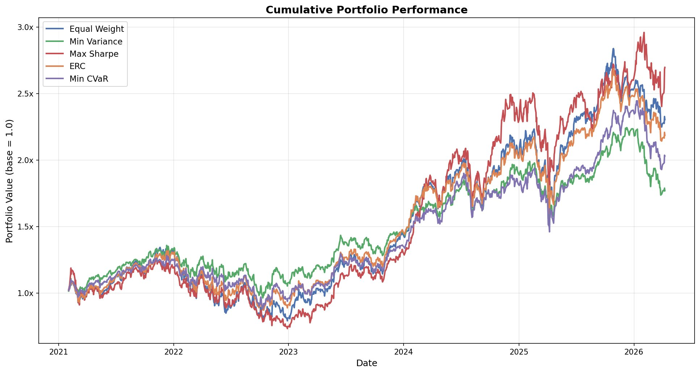
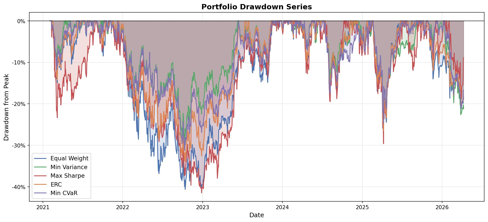
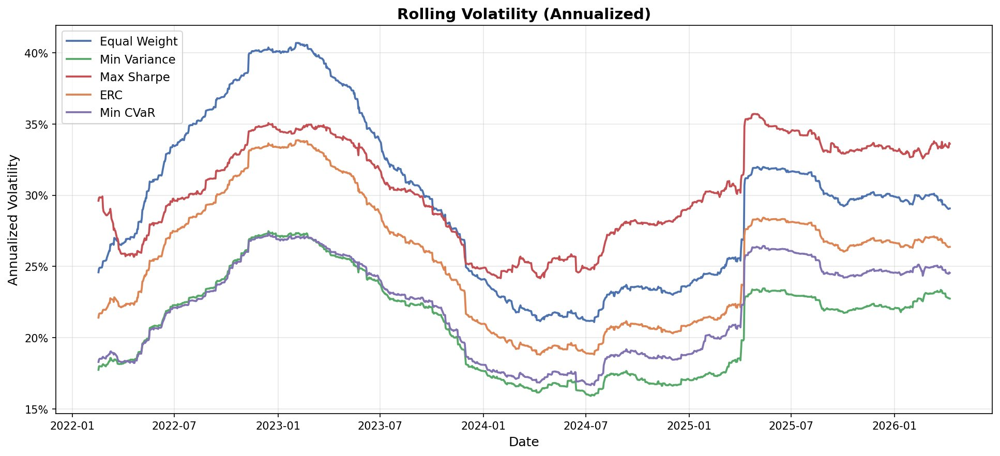
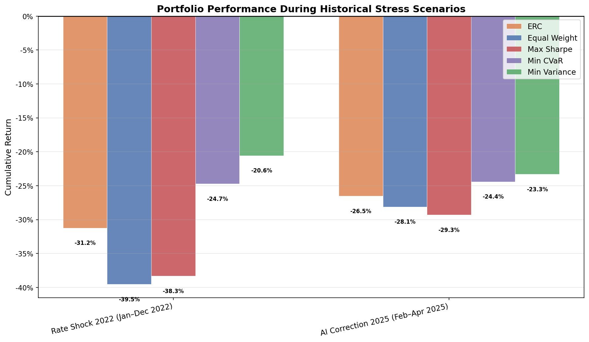
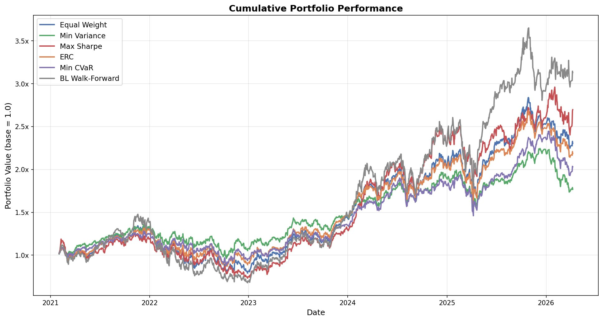

# LSEG Thematic Portfolio Optimization

[](https://www.python.org/)
[](https://developers.refinitiv.com/)
[](https://opensource.org/licenses/MIT)

A research-grade portfolio optimization framework built on a 20-stock AI/Tech universe, using daily price data from the LSEG Data API. The project compares allocation strategies across return, risk, tail behaviour, and factor exposure — with a walk-forward backtest structure that avoids look-ahead bias.

The project is organized in three layers:

**A — Core walk-forward framework:** five strategies backtested with monthly rebalancing and transaction costs (2021–2026).

**B — Risk & factor layer:** stress testing, factor exposures, covariance estimators, and a detailed look at how ERC balances risk contributions.

**C — Black-Litterman extensions:** a static analytical model (not a backtest) and a dynamic walk-forward extension driven by momentum views — with full reporting showing why it outperforms but at materially higher tail risk.

---

## Universe — 20 AI/Tech stocks

| Ticker | Company | History |
|--------|---------|---------|
| NVDA.O | NVIDIA | Full (2020–) |
| MSFT.O | Microsoft | Full (2020–) |
| GOOGL.O | Alphabet | Full (2020–) |
| META.O | Meta | Full (2020–) |
| AMZN.O | Amazon | Full (2020–) |
| AAPL.O | Apple | Full (2020–) |
| AMD.O | AMD | Full (2020–) |
| CRM.N | Salesforce | Full (2020–) |
| ORCL.N | Oracle | Full (2020–) |
| ADBE.O | Adobe | Full (2020–) |
| QCOM.O | Qualcomm | Full (2020–) |
| INTC.O | Intel | Full (2020–) |
| IBM.N | IBM | Full (2020–) |
| NOW.N | ServiceNow | Full (2020–) |
| MSTR.O | MicroStrategy | Full (2020–) |
| TSM.N | TSMC | Full (2020–) |
| ASML.O | ASML | Full (2020–) |
| SNOW.N | Snowflake | From Sep 2020 |
| ARM.O | ARM Holdings | From Sep 2023 |
| PLTR.N | Palantir | From Nov 2024 |

SNOW, ARM, and PLTR enter the optimizer progressively as their return history reaches the 252-day lookback threshold. Each rebalance window independently excludes any ticker with incomplete data — no contamination of the covariance matrix.

---

## A — Core Walk-Forward Framework

### The five strategies

| Strategy | Objective | Design intent |
|---|---|---|
| **Equal Weight** | Uniform capital allocation | Naive, estimation-error-free baseline |
| **Min Variance** | Minimize $w^\top \Sigma w$ | Defensive — capital preservation |
| **Max Sharpe** | Maximize $(w^\top\mu - r_f)/\sigma_p$ | Growth — best risk-adjusted return |
| **ERC** | Equalize each asset's risk contribution | Risk diversification without return estimation |
| **Min CVaR** | Minimize expected loss in worst 5% of days | Tail-risk reduction |

**On ERC:** Equal Weight gives every asset the same dollar allocation. ERC gives every asset the same *risk* allocation. In practice, this means overweighting low-volatility names like IBM and GOOGL and underweighting high-volatility names like NVDA and AMD. The result is genuine risk diversification, not just capital spreading.

**On Min CVaR:** The implementation uses the Rockafellar-Uryasev LP reformulation (HiGHS solver), which guarantees a global optimum on the convex CVaR objective. An earlier SLSQP implementation produced momentum-concentrated portfolios — the LP fix is what makes the results economically sensible.

### Walk-forward parameters

| Parameter | Value |
|---|---|
| Rebalance frequency | Monthly |
| Lookback window | 252 trading days |
| Transaction cost | 15 bps per turnover unit |
| Max weight per stock | 20% |
| Risk-free rate | 4% (annualized) |
| Backtest period | Jan 2021 – Apr 2026 |

### Results

| Portfolio | Ann. Return | Ann. Vol | Sharpe | Max Drawdown | Calmar |
|-----------|------------:|---------:|-------:|-------------:|-------:|
| Equal Weight | 18.48% | 28.93% | 0.50 | −41.1% | 0.45 |
| Min Variance | 12.29% | 20.83% | 0.40 | −29.1% | 0.42 |
| Max Sharpe | 22.33% | 30.94% | 0.59 | −41.5% | 0.54 |
| ERC | 17.22% | 25.06% | 0.53 | −33.9% | 0.51 |
| Min CVaR | 15.48% | 21.89% | 0.52 | −31.2% | 0.50 |

*Source: `output/reports/portfolio_summary_v2.csv` — regenerated at each run.*

### How to read these results

**The defensive strategies:** Min Variance and Min CVaR both keep max drawdown around −29 to −31%, versus −41% for Equal Weight and Max Sharpe. They reach similar defensive postures through different mechanisms: Min Variance minimizes total variance (concentrating in low-vol Cloud/Enterprise names), while Min CVaR minimizes the expected loss on the worst 5% of trading days.

**The return vs risk tradeoff:** Max Sharpe generates the highest return (22.3%) but ties with Equal Weight for the worst drawdown (−41.5%). Equal Weight takes the same downside risk without the return upside — a poor trade. ERC offers a better balance: 17.2% return at only −33.9% drawdown, with no need to estimate expected returns.

**What the Sharpe ratios say:** ERC (0.53), Min CVaR (0.52), and Max Sharpe (0.59) are close. Min Variance lags (0.40) because its defensive tilt sacrifices too much return. Equal Weight (0.50) is the mid-range baseline.

**V2.1 vs V1:** V1 optimizes once on 2020–2024 training data. V2.1 re-optimizes every month using only the past 252 days, adapting to volatility regimes and correlations as they evolve. V2.1 is the correct structure for genuine backtesting.

### Key charts







---

## B — Risk & Factor Layer

### Stress Testing

Two historical scenarios fall fully within the V2.1 backtest window (Jan 2021 – Apr 2026).

> **COVID Crash (Feb–Mar 2020)** is kept as a historical reference scenario. It predates the first valid V2.1 rebalance window, so no dynamic walk-forward performance exists for that period. It appears as "no data" in the stress output.

| Scenario | Equal Weight | Min Variance | Max Sharpe | ERC | Min CVaR |
|---|---:|---:|---:|---:|---:|
| Rate Shock 2022 (Jan–Dec) | −39.5% | −20.6% | −38.3% | −31.2% | −24.7% |
| AI Correction 2025 (Feb–Apr) | −28.1% | −23.3% | −29.3% | −26.5% | −24.4% |

*Source: `output/reports/stress_metrics_v2_historical.csv`*

**Rate Shock 2022** is the most informative scenario — a full calendar year of rate-driven drawdown. Min Variance loses roughly half what Equal Weight does (−20.6% vs −39.5%). The consistent ordering across both scenarios is: **Min Variance ≤ Min CVaR ≤ ERC ≤ Equal Weight ≤ Max Sharpe**.



### Factor Exposure Analysis

Rolling beta, momentum score, and sector allocation computed at each rebalance (60-day window, equal-weight market proxy).

| Strategy | Beta | Momentum | Semiconductors | Cloud/Enterprise | Software | Consumer |
|---|---:|---:|---:|---:|---:|---:|
| Equal Weight | 1.00 | 0.30 | 35.0% | 35.0% | 20.0% | 5.0% |
| Min Variance | 0.59 | 0.19 | 5.7% | 81.4% | 0.0% | 12.9% |
| Max Sharpe | 0.98 | 0.71 | 67.4% | 20.0% | 12.6% | 0.0% |
| ERC | 0.85 | 0.25 | 28.3% | 44.9% | 15.3% | 6.4% |
| Min CVaR | 0.64 | 0.23 | 21.4% | 59.7% | 2.2% | 16.7% |

*Source: `output/reports/factor_exposure_v2.csv`*

The factor table explains each strategy's return/risk profile through its actual positioning:

**Min Variance** (beta 0.59) almost entirely avoids Semiconductors (5.7%) and concentrates in Cloud/Enterprise (81%). The optimizer finds that low-volatility stocks are disproportionately Cloud/Enterprise names in this universe. This explains its drawdown protection and its lower return.

**Max Sharpe** (momentum 0.71) concentrates heavily in Semiconductors (67%). The optimizer finds that AI-driven semiconductor names have the best historical Sharpe. This explains both its high return and its crash sensitivity.

**Min CVaR** (beta 0.64) mirrors Min Variance in beta and sector tilt: Cloud-heavy, Semiconductor-light. Different objective, similar defensive outcome. Its Consumer allocation (16.7%) is distinctive — these names have smaller daily tail losses.

**ERC** (beta 0.85) is the most sector-diversified: no sector exceeds 45%, all sectors represented. This is the natural consequence of risk-equalizing across 20 assets with different sector memberships.

### ERC: Capital Diversification vs Risk Diversification

ERC equalizes the *risk contribution* of each asset to total portfolio volatility, not the *capital weight*. High-volatility assets (MSTR, AMD, NVDA) receive lower capital weights in ERC, but after adjusting for their volatility, each asset contributes approximately the same amount to total portfolio risk. Equal Weight achieves capital diversification but not risk diversification — high-vol assets dominate the risk budget.

### Covariance Estimation

Three covariance estimators are available, configurable via `settings.yaml`:

| Method | Description | Regime |
|---|---|---|
| `sample` | Standard sample covariance | Default baseline |
| `factor` | OLS factor model: Σ = BFBᵀ + D (3 sector factors) | When factor structure is meaningful |
| `ledoit_wolf` | Analytical shrinkage toward scaled identity | When T/n ≈ 10–15 |

In this project (T=252, n=17–20), T/n ≈ 13 — a moderate regime where Ledoit-Wolf provides measurable regularisation. The factor model imposes sector structure and is more interpretable, though its advantage over sample covariance depends on whether the true structure is well-captured by 3 sector factors.

---

## C — Black-Litterman Extensions

### C1 — Static BL (Analytical — Not a Backtest)

The static BL model is a point-in-time computation. It shows what a Max Sharpe portfolio looks like when three analyst views are blended into the equilibrium prior using the full-sample covariance. It produces a single set of weights — **not a time series of returns, not a backtest result**.

**Model pipeline:**

| Step | Formula | Description |
|---|---|---|
| Market prior | $\Pi = \lambda \Sigma w_{mkt}$ | Implied returns (λ=2.5, EW market proxy) |
| Views | $P, Q, \Omega$ | Analyst beliefs as portfolio positions |
| Posterior | $\mu_{BL} = M^{-1}[(\tau\Sigma)^{-1}\Pi + P'\Omega^{-1}Q]$ | τ=0.05, Ω=τPΣPᵀ |
| Portfolio | $\max_w (w'\mu_{BL} - r_f)/\sigma_p$ | Max Sharpe on posterior |

**Three analyst views:**

| # | Type | View | Expected return |
|---|---|---|---:|
| 1 | Absolute | NVDA — AI chip supercycle | +40% |
| 2 | Relative | NVDA outperforms INTC | +20% spread |
| 3 | Sector | Semiconductors vs Cloud | +10% spread |

*Outputs: `output/reports/bl_weights_v1.csv`, `output/reports/bl_returns_v1.csv`*

### C2 — BL Walk-Forward (Dynamic Extension)

A fully systematic, rule-based walk-forward extension. At each monthly rebalance, the top-3 momentum assets (6-month lookback) are expected to outperform the bottom-3 by 10% annualized. This view is passed through the BL posterior formula to compute weights, then applied to the next period.

**Walk-forward backtest results (Jan 2021 – Apr 2026):**

| Metric | BL Walk-Forward | Max Sharpe (ref) |
|---|---:|---:|
| Annualized Return | 26.09% | 22.33% |
| Annualized Volatility | 36.10% | 30.94% |
| Sharpe Ratio | 0.61 | 0.59 |
| Max Drawdown | −54.08% | −41.5% |
| Calmar Ratio | 0.48 | 0.54 |

**Why BL Walk-Forward outperforms on return but suffers worse drawdowns:**

The factor exposure analysis explains this cleanly. BL Walk-Forward systematically tilts toward recent momentum winners — in this AI/Tech universe, that means heavy Semiconductor concentration during 2024–2025 (NVDA, AMD, TSM). During the upswing, momentum captures the full AI rally. During corrections (Rate Shock 2022, AI Correction 2025), the same concentration amplifies losses because Semiconductors sell off harder than Cloud/Enterprise defensives.

The rolling volatility chart confirms this: BL Walk-Forward runs consistently at 33–36% annualized volatility, above Max Sharpe (~30–33%) and far above Min Variance (~18–22%). The stress test comparison shows BL Walk-Forward as the worst performer in every drawdown scenario — its Calmar ratio (0.48) is the lowest despite having the highest return.

> **Conclusion:** the BL dynamic extension improves return and slightly improves Sharpe, but materially worsens drawdown and tail risk. It is a higher-conviction, higher-tail-risk strategy. An investor who cannot tolerate a −54% drawdown should not deploy it.



*Full BL reporting (drawdown, rolling volatility, rolling Sharpe, stress tests, factor exposures) is generated by `main.py` in `output/charts/` with the `_with_bl` suffix.*

*Design: rule-based, systematic, no look-ahead. Grounded in cross-sectional momentum (Jegadeesh & Titman, 1993). One relative view per window keeps the Omega matrix 1×1.*

---

## Methodology

### Optimization formulations

| Strategy | Objective | Solver |
|---|---|---|
| Min Variance | $\min_w w^\top \Sigma w$ | SLSQP |
| Max Sharpe | $\max_w (w^\top\mu - r_f)/\sigma_p$ | SLSQP |
| ERC | $\min_w \sum_i (RC_i - \sigma_p/n)^2$ | SLSQP |
| Min CVaR | $\min_{w,\zeta,u} \zeta + \frac{1}{(1-\alpha)T}\sum_t u_t$ | HiGHS LP |
| BL Walk-Forward | Momentum-view posterior → Max Sharpe | Analytical + SLSQP |

All strategies: long-only, fully invested, 20% max weight per stock.

### Performance metrics

| Metric | Formula |
|---|---|
| Annualized Return | Geometric: $(1 + r_d)^{252/T} - 1$ |
| Annualized Volatility | $\sigma_d \times \sqrt{252}$ |
| Sharpe Ratio | $(\text{Ann. Return} - r_f) / \text{Ann. Vol}$ |
| Max Drawdown | $\min_t (C_t / \max_{s \leq t} C_s - 1)$ |
| Calmar Ratio | Ann. Return $/ |\text{Max Drawdown}|$ |

### Limitations

- **Universe concentration:** the 20-stock AI/Tech universe is not representative of broader markets. Results reflect AI/Tech sector dynamics (2021–2026), not general market conditions.
- **Lookback adaptation:** the 252-day lookback adapts to volatility regimes but cannot anticipate structural breaks. All strategies suffered during the 2022 rate shock because the prior 252 days did not predict it.
- **Transaction costs:** modelled as a flat 15 bps per turnover unit. Real costs vary by execution, market impact, and liquidity.
- **COVID stress:** the V2.1 walk-forward starts in early 2021, so COVID 2020 is a historical reference only — not a realized V2 result.
- **BL momentum views:** the walk-forward BL uses a single momentum signal. A more robust implementation would combine multiple signals and test for overfitting to the specific backtest window.

---

## Project Structure

```
lseg-thematic-portfolio-optimization/
├── main.py                     # V2.1 orchestration (core + BL reporting)
├── config/settings.yaml        # All parameters (covariance_method, etc.)
├── src/
│   ├── portfolio.py            # EW, Min Variance, Max Sharpe, ERC, Min CVaR (LP)
│   ├── covariance.py           # Sample, factor (Σ=BFBᵀ+D), Ledoit-Wolf
│   ├── rebalancer.py           # Walk-forward engine, valid-asset filtering
│   ├── black_litterman.py      # Static BL + walk-forward (momentum views)
│   ├── stress.py               # Historical stress scenario analysis
│   ├── factor_analysis.py      # Beta, momentum, sector exposure
│   ├── metrics.py              # Sharpe, volatility, drawdown, rolling metrics
│   ├── backtest.py             # Cumulative performance, return series
│   ├── visualization.py        # All charts (core + BL variants)
│   ├── preprocessing.py        # Price cleaning, return computation
│   ├── data_fetcher.py         # LSEG Data API integration
│   └── utils.py                # Config loader
├── tests/
│   ├── test_portfolio.py       # Optimizer math, metrics, rebalancer logic
│   ├── test_covariance.py      # Factor model and Ledoit-Wolf correctness
│   ├── test_black_litterman.py # BL math, view generation, walk-forward
│   └── test_stress.py          # Stress scenario computation
├── docs/images/                # Charts used in this README
│   └── legacy/                 # Older charts (V1, pre-CVaR, secondary)
└── output/                     # Generated at runtime — not versioned
    ├── charts/                 # All generated charts (including _with_bl variants)
    └── reports/                # All generated CSVs
```

> The `output/` directory is generated by `python main.py` and is listed in `.gitignore`. All CSV reports and charts are regenerated at each run. The `docs/images/` directory contains a curated subset of charts referenced by this README.

---

## Installation

```bash
git clone https://github.com/Morwane/lseg-thematic-portfolio-optimization.git
cd lseg-thematic-portfolio-optimization
python3 -m venv .venv
source .venv/bin/activate
pip install -r requirements.txt
```

LSEG Data Desktop must be running locally before executing `main.py`. See [refinitiv.com](https://www.refinitiv.com/en/products/refinitiv-data-desktop).

### Running tests (no LSEG required)

```bash
pytest tests/ -v
```

All tests use synthetic data — no credentials needed.

---

## Roadmap

- [x] Equal Weight, Min Variance, Max Sharpe
- [x] ERC (Equal Risk Contribution)
- [x] Monthly walk-forward rebalancing with transaction costs
- [x] Min CVaR via LP (Rockafellar-Uryasev exact formulation)
- [x] Historical stress testing (Rate Shock 2022, AI Correction 2025)
- [x] Factor exposure analysis (beta, momentum, sector)
- [x] Factor-model covariance estimation (Barra-style OLS, Σ = BFBᵀ + D)
- [x] Ledoit-Wolf shrinkage covariance estimator
- [x] Black-Litterman static (3 analyst views, AI/Tech thesis)
- [x] Black-Litterman walk-forward (dynamic momentum views)
- [x] Full BL reporting (drawdown, rolling vol, rolling Sharpe, stress, factor exposures)
- [ ] Validate and document factor-model covariance in BL prior

---

## License

MIT
